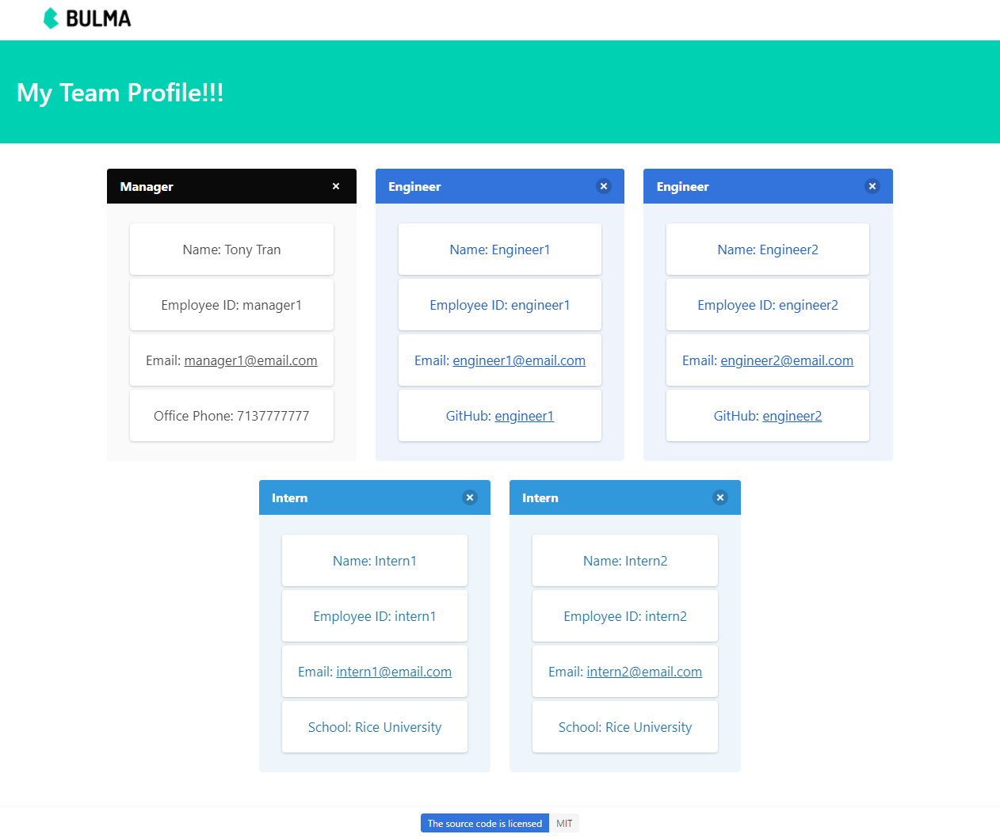

# My Node Team Generator!

License: 

## Description 

This is a project team profile generator to help manage your team which can consist of Engineer, Intern, and the manager. This will help take the time off the manager and more time on getting the project completed. 

Screenshot:

## Table of Contents

* [Installation](#installation)
* [Usage](#usage)
* [License](#license)
* [Contributing](#contributing)
* [Tests](#tests)
* [Questions](#questions)

## Installation

To run this application, you will need to install the following modules: 
  - nodeJS
  - Inquirer
  - Jest
  - Open module

## Usage 

You will open the app with "node index.js". Once the app starts, you will be presented with questions about the manager and then the team information details. Enter all their information on the command line interface (CLI) and the application will generate a HTML file with the information you entered for your team. Your generated file will be located in the "dist" folder of the project folder along with the CSS file. 

A demo video walkthrough can be viewed at the link below. 

[Video Walkthrough](https://drive.google.com/file/d/1Uk0bIg2LE5T5aZ2xYjvja0l1C_mWsccF/view?usp=sharing)

## License

MIT

## Contributing

You can contribute to the application by creating a forked copy on your repo. Once your modifications are done, request a push to my repo and I will review it before it gets applied to the repo. 

## Tests

You can test the application using the jest command "npm test" on your node terminal. Testing scripts are located in the "__tests__" folder of the project. 

## Questions

If you have any questions, feel free to contact me and listed below are my contact informations. 

GitHub profile: code-monkey713

Email: codemonkey713@gmail.com

